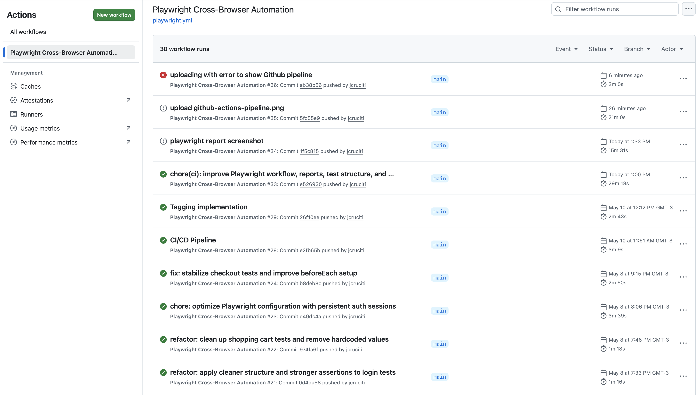
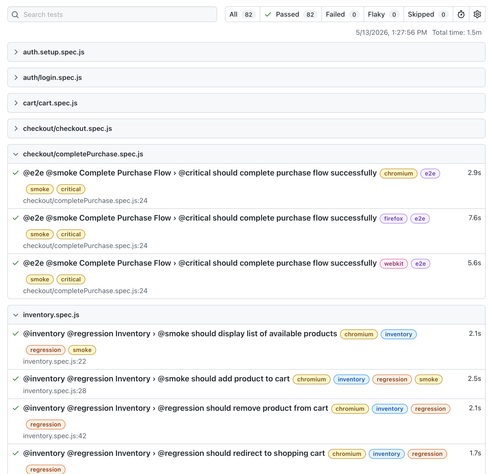

# 🎭 Playwright E2E Automation Framework

Scalable end-to-end test automation framework built with **Playwright** using the **Page Object Model (POM)** architecture to simulate real-world e-commerce user flows.

🔗 Application under test: https://www.saucedemo.com/

---

# 📌 Project Overview

This project demonstrates modern QA Automation practices focused on scalability, maintainability, cross-browser execution, and CI/CD integration.

## Key capabilities demonstrated

- End-to-end UI automation
- Functional and regression testing
- Cross-browser execution (Chromium, Firefox, WebKit)
- Page Object Model (POM)
- Persistent authentication using Playwright `storageState`
- Cart persistence validation
- Checkout flow validation
- Business logic validation (pricing and totals)
- Dynamic test data generation with Faker
- Automated CI pipeline with GitHub Actions
- Secure credential handling with GitHub Secrets
- Automated Playwright HTML report generation
- CI/CD-ready architecture

---

# 🧪 Test Coverage

## 🔐 Authentication

- Valid login authentication
- Invalid login validation
- Error message validation
- Persistent session handling via `storageState`

---

## 🛍️ Inventory

- Product listing validation
- Add/remove products from cart
- Cart badge synchronization
- Cart persistence across sessions
- Sorting validation:
  - A → Z
  - Z → A
  - Price Low → High
  - Price High → Low

---

## 🛒 Cart

- Cart badge synchronization
- Item quantity validation
- Product removal behavior
- Empty cart validation
- Navigation between cart and inventory

---

## 💳 Checkout

- Complete checkout workflow
- Required field validation
- Checkout step navigation
- Subtotal calculation validation
- Order completion validation
- Success confirmation validation

---

# 🔄 End-to-End Flow

```text
Login (via storageState)
→ Add products
→ Cart
→ Checkout
→ Order completion
```

---

# 🏗️ Project Structure

```bash
PLAYWRIGHT-QA-PORTFOLIO
│
├── .github/
│   └── workflows/
│       └── playwright.yml
│
├── .vscode/
│   └── settings.json
│
├── api/
│   ├── auth/
│   ├── users/
│   └── utils/
│
├── assets/
│
├── auth/
│
├── docs/
│
├── fixtures/
│
├── node_modules/
│
├── pages/
│   ├── CartPage.js
│   ├── CheckoutPage.js
│   ├── InventoryPage.js
│   └── LoginPage.js
│
├── playwright/
│
├── playwright-report/
│
├── test-results/
│
├── tests/
│   ├── auth/
│   ├── cart/
│   │   └── cart.spec.js
│   │
│   ├── checkout/
│   │   ├── checkout.spec.js
│   │   └── completePurchase.spec.js
│   │
│   ├── setup/
│   │
│   ├── auth.setup.spec.js
│   └── inventory.spec.js
│
├── utils/
│
├── .env
├── .eslintignore
├── .eslintrc.cjs
├── .gitignore
├── .prettierrc
├── package-lock.json
├── package.json
├── playwright.config.js
└── README.md
```

---

# ⚙️ Setup & Installation

## Clone repository

```bash
git clone https://github.com/jcruciti/playwright-qa-portfolio.git
cd playwright-qa-portfolio
```

---

## Install dependencies

```bash
npm install
npx playwright install
```

---

## Create `.env`

```bash
SAUCE_USER=standard_user
SAUCE_PASSWORD=secret_sauce
```

---

# ▶️ Running Tests

## Run all tests

```bash
npx playwright test
```

---

## Run headed mode

```bash
npx playwright test --headed
```

---

## Run Playwright UI Mode

```bash
npx playwright test --ui
```

---

## Run smoke suite

```bash
npx playwright test --grep @smoke
```

---

## Run regression suite

```bash
npx playwright test --grep @regression
```

---

## Run checkout tests only

```bash
npx playwright test --grep @checkout
```

---

# 📊 Reports

## Open Playwright HTML Report

```bash
npx playwright show-report
```

---

## Report location

```bash
playwright-report/
```

---

# 🏗️ Architecture & Design Patterns

## ✅ Page Object Model (POM)

This framework uses the Page Object Model architecture to improve:

- Reusability
- Maintainability
- Separation of concerns
- Scalability
- Readability

---

# 🔐 Authentication Strategy

This project evolved from repetitive UI login execution in `beforeEach` to persistent authentication using Playwright `storageState`.

---

## ❌ Legacy Approach

```js
test.beforeEach(async ({ page }) => {
  const loginPage = new LoginPage(page);

  await loginPage.open();

  await loginPage.login(process.env.SAUCE_USER, process.env.SAUCE_PASSWORD);
});
```

---

## ✅ Current Approach

Authentication is executed once in a dedicated setup project.

### Storage state configuration

```js
storageState: 'playwright/.auth/user.json';
```

---

## ✅ Benefits

- Faster execution
- More stable tests
- Reduced UI dependency
- Better CI performance
- Cleaner test isolation

---

# 🎲 Test Data Strategy

```js
const defaultUser = {
  firstName: faker.person.firstName(),
  lastName: faker.person.lastName(),
  postalCode: faker.location.zipCode(),
};
```

---

# 🔧 Best Practices Implemented

- Page Object Model architecture
- Persistent authentication via `storageState`
- Test isolation
- Stable selectors
- Modular framework structure
- Environment variable management
- Reusable setup architecture
- Cross-browser execution
- CI/CD integration
- HTML reporting

---

# 🏷️ Test Tagging Strategy

This project uses Playwright test tags to support scalable execution pipelines.

## Available tags

- `@smoke`
- `@regression`
- `@checkout`
- `@cart`
- `@inventory`
- `@auth`
- `@e2e`
- `@critical`

---

# 🚀 CI/CD Pipeline

This project includes a GitHub Actions pipeline with:

- Automatic execution on `push`
- Automatic execution on `pull_request`
- Cross-browser execution
- Smoke and regression suite separation
- Secure credential handling
- Playwright HTML report artifact upload
- Parallelized browser execution
- Pipeline concurrency control
- Linux-based CI execution

---

# 📊 CI/CD Workflow Features

- Chromium execution
- Firefox execution
- WebKit execution
- Artifact retention
- Automated HTML reports
- Matrix execution strategy
- GitHub Secrets integration
- npm dependency caching

---

# 📸 CI/CD Pipeline Preview

Add your GitHub Actions screenshot here:

```bash
docs/images/github-actions-pipeline.png
```

```md

```

---

# 📸 Playwright HTML Report Preview

Add your Playwright HTML report screenshot here:

```bash
docs/images/playwright-report.png
```

```md

```

---

# 💡 Highlights

- Persistent authentication via `storageState`
- Cart persistence validation
- Checkout flow validation
- Business logic verification
- Cross-browser execution
- Scalable automation architecture
- Automated CI execution
- GitHub Actions integration

---

# 🚀 CI/CD Ready

- GitHub Actions compatible
- Jenkins-ready structure
- Docker-ready architecture

---

# 📈 Roadmap

- Playwright API integration
- Visual regression validation
- Advanced reporting integration
- Docker execution support
- Parallel execution optimization

---

# 👨‍💻 Author

Joe Cruciti  
QA Automation Engineer
